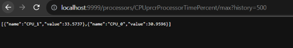
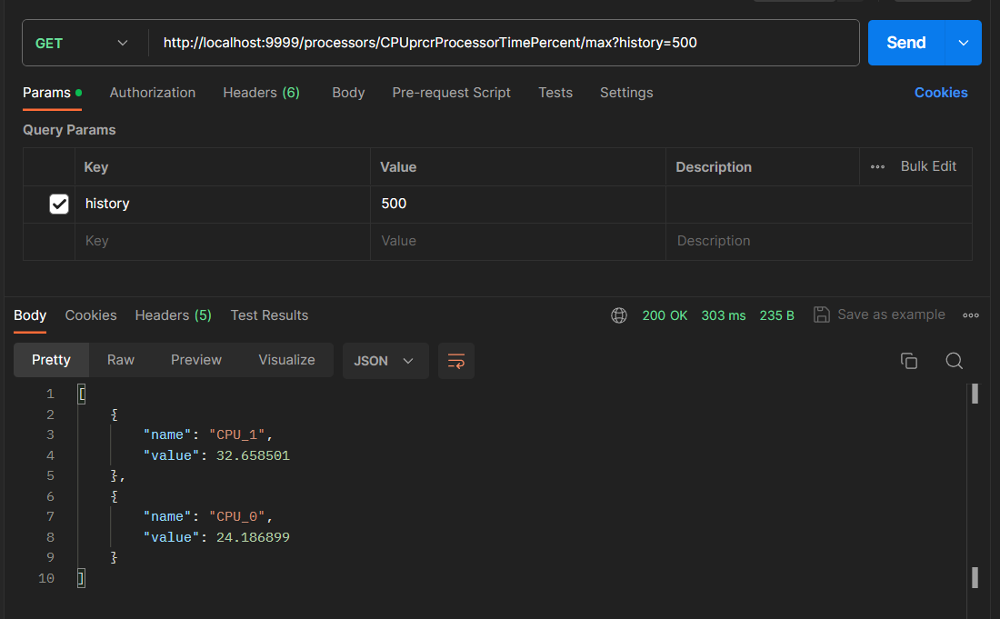
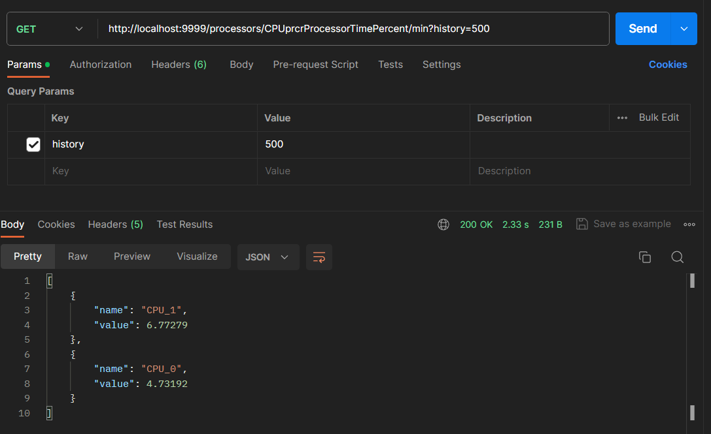
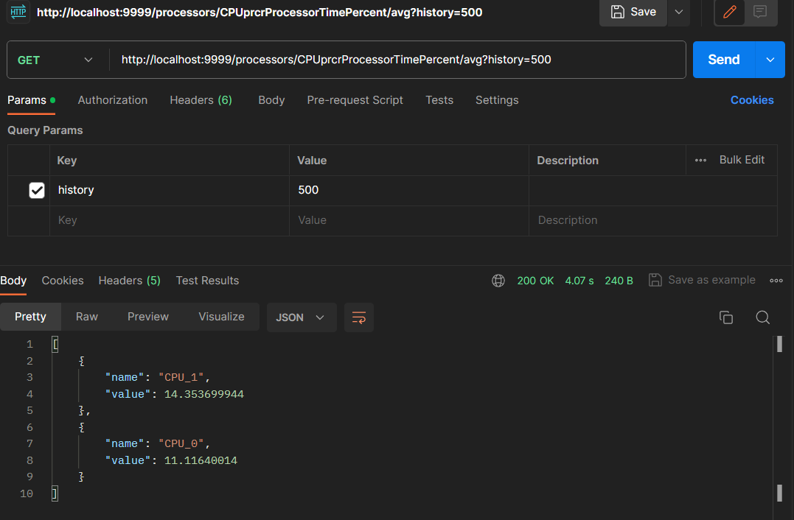

## Test2 Application

***

The goal is to create a Java REST API that provides information about each processor available through a third-party Web Service. Specifically, the API should retrieve and display the minimum, maximum, or average value obtained from the "CPU time percent" historical data points.

### Prerequisites :

ensure you have met the following requirements:

* Java Development Kit (JDK) installed (17)
* Apache Maven installed
* Your favorite integrated development environment (IDE)

### Getting Started :

To get a local copy of this project up and running, follow these steps:

1. Clone the repository to your local machine:

``
git clone https://github.com/Kawtarkoki/Test2.git
``
2. Open the project in your IDE.

    Build the project using Maven:

``
mvn clean install
``
3. Run the application

    The application will be accessible at :
* http://localhost:9999/processors/CPUprcrProcessorTimePercent/max?history=500
* http://localhost:9999/processors/CPUprcrProcessorTimePercent/min?history=500
* http://localhost:9999/processors/CPUprcrProcessorTimePercent/avg?history=500

